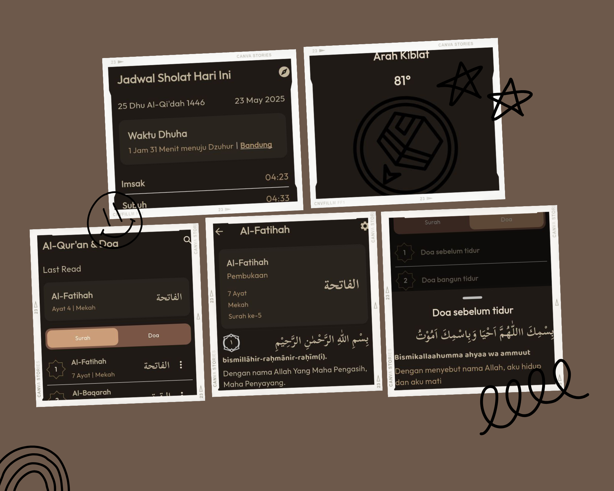

# Proyek Aplikasi Al-Quran Flutter


---
Ready to take your Flutter skills to the next level? This open-source Quran app is the perfect foundation for building a beautifully designed, feature-rich Islamic application. Whether you're learning, exploring, or planning to deploy, this project gives you a solid head start.

## 🚀 Prerequisites

* Flutter SDK (latest version recommended)
* Android Studio or VS Code with installed flutter plugin
* Android emulator or physical device

## 🔧 Installation Steps

1.  **Install Flutter SDK:**
    * If you haven’t installed Flutter yet, [download it here](https://flutter.dev/docs/get-started/install).
    * Make sure to add Flutter to your system’s PATH.
2.  **Clone the Repository:**
    * Extract the project folder you received, or clone from your preferred source.
3.  **Open the Project:**
    * Open the project using Android Studio or VS Code.
4.  **Install Dependencies:**
    * Run the following command in your terminal inside the project directory:

    ```bash
    flutter pub get
    ```

    * This will fetch all required packages.
5.  **Run the App:**
    * Connect an Android device or start an emulator.
    * Launch the app with:

    ```bash
    flutter run
    ```

    * Aplikasi akan berjalan di perangkat atau emulator Anda.

## 📁 Project Structure

* `lib/`: Main application source code.
* `assets/`: Contains images, fonts, and JSON files for Surahs and Duas.
* `pubspec.yaml`: Project configuration and dependency list.

## ⚠️ Important Notes

* Currently supports Bahasa Indonesia only.
* No official copyright registered.
* Feel free to customize and extend the app to suit your needs.

## 🤝 Contribute & Collaborate

Spotted a bug or have a feature in mind? Contributions are welcome! Let’s improve this app together — just open an issue or submit a pull request.

---

Thank you for checking out this project — may it bring benefit to many!
